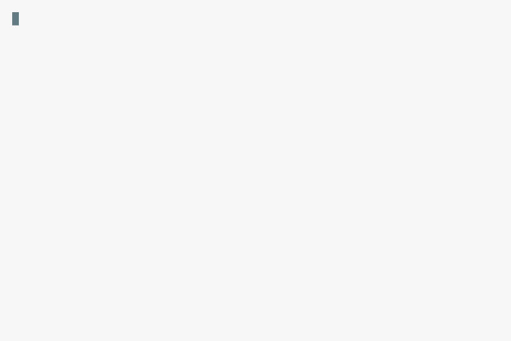
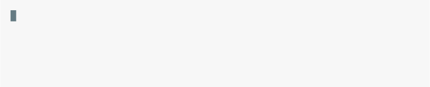
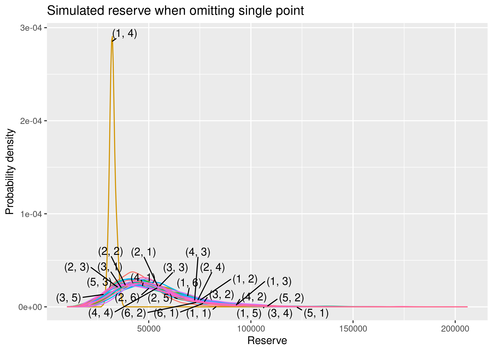

<!-- README.md is generated from README.Rmd. Please edit that file -->

# trngl

<!-- badges: start -->
<!-- badges: end -->

trngl provides simulation-based tools for checking the assumptions of
actuarial reserving models.

## Installation

``` r
install.packages("trngl")

# To get the development version from GitHub:
# install.packages("remotes")
remotes::install_github("oelhammouchi/trngl@develop")
```

## Example

Flag a suspicious point:

<picture>
<source media="(prefers-color-scheme: dark)" srcset="man/figures/README-/unnamed-chunk-2-dark.svg">

</picture>

Inspect the simulation results:

<picture>
<source media="(prefers-color-scheme: dark)" srcset="man/figures/README-/unnamed-chunk-3-dark.svg">

</picture>

``` r
plot(res)
```


