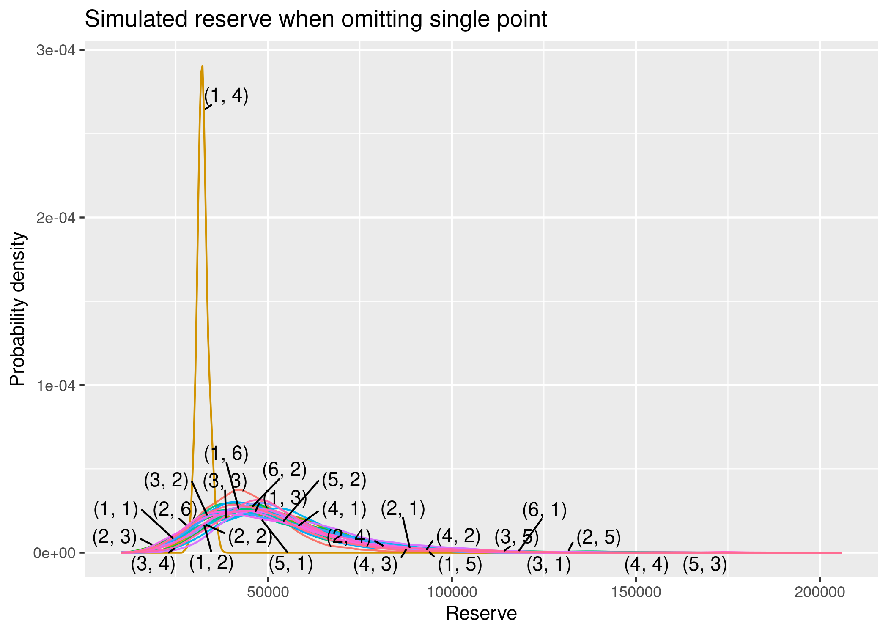

<!-- README.md is generated from README.Rmd. Please edit that file -->

# trngl

<!-- badges: start -->
<!-- badges: end -->

trngl provides simulation-based tools for checking the assumptions of
actuarial reserving models.

## Installation

``` r
install.packages("trngl")

# To get the development version from GitHub:
# install.packages("remotes")
remotes::install_github("oelhammouchi/trngl@develop")
```

## Example

Flag a suspicious point:

``` r
library(trngl)

triangle <- cum2incr(UKMotor)
triangle[1, 4] <- 10 * triangle[1, 4]
triangle <- incr2cum(triangle)
res <- odpResidSim(triangle, "single",
  n_boot = 1e2,
  n_sim = 1e2,
  progress = FALSE
)
print(triangle)
#> ┌─────────────────────────────────────────┐
#> │  3511 6726 8992 26112 27171 27758 28098 │
#> │  4001 7703 9981 11161 12117 12746       │
#> │  4355 8287 10233 11755 12993            │
#> │  4295 7750 9773 11093                   │
#> │  4150 7897 10217                        │
#> │  5102 9650                              │
#> │  6283                                   │
#> └─────────────────────────────────────────┘
```

Visualise the simulation result, either by plotting…

``` r
plot(res)
```



… or with a summary

``` r
print(res)
#> ── ODP bootstrap simulation test ───────────────────────────────────────────────
#> • bootstrap iterations: 100
#> • simulation iterations: 100
#> • status:
#> 
```
